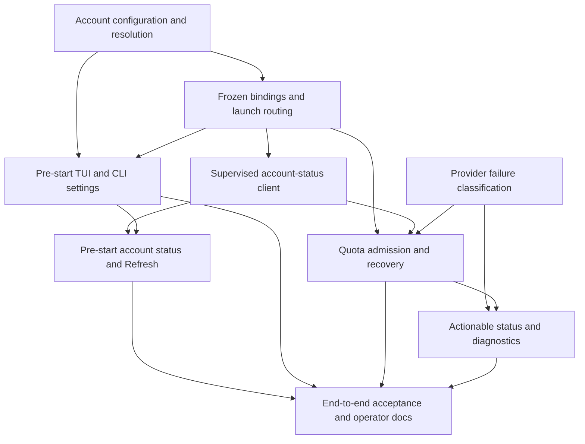

# Codex accounts by agent class and actionable usage-limit failures

## Current delivery scope

The requested implementation delivers T1, T2, and the selection-only portion of T5.
T5 covers choosing homes, inheritance, confirmation, CLI selectors, and Save defaults.
Usage/status inspection and Refresh are deferred to T9; quota handling remains in T3/T4/T6/T7/T8.
Selected-account default-model discovery belongs to T2 so routing is complete without T3.
The broader workflows and status contracts below remain the specification for that deferred work.

### Delivered and verified — 2026-09-10

T1, T2, and selection-only T5 are implemented. T9 and the quota/status tasks remain open.
Runs use v4 account snapshots. The sole operator explicitly removed legacy credential
and migration requirements on 2026-09-10: no `--auth-cache`, v3 reader, or global cache mode.
The README documents selectors, inheritance, saving defaults, private homes, and resume.

- Configuration: `test/accounts.test.ts` covers strict preferences, precedence, literal paths,
  canonical selection, atomic saves, principal continuity, and access-token-only projection.
- Routing: `test/account-routing.integration.test.ts` covers three SDK account launches,
  native manifests and projection, advanced classes, continued and replacement agents,
  changed sources, reopen, and model-facing inspection privacy.
- Discovery and handoff: `test/account-model-discovery.integration.test.ts` exercises a confined
  fake app-server with bounded model/list requests and real stop receipts;
  `test/runtime-handoff.integration.test.ts` preserves v4 selections across SDK/Herdr handoff.
- Selection: Ink, CLI, and real PTY tests cover choosing three homes, inheritance,
  explicit saving, exact creation-time persistence, cancellation, and terminal cleanup.

Validation: build, typecheck, and repository formatting checks passed. The full non-live run
reported 1,381 passed, 88 skipped, and four failures. Three scope-closure cases failed during
an overlapping rebuild and passed on a subsequent unchanged-code rerun; their retained
errors report interrupted fixture operations, so the rebuild attribution remains an inference.
The fourth failure was an outdated resume-summary expectation, corrected to assert the new
account summary; all 16 browser tests then passed. Across the full run and these targeted
reruns, all 1,385 executed cases passed. Live provider/native-session tests were not enabled.

## Ownership and scope

Status: reviewed plan; implementation has not started.
Created: 2026-09-10.
Repository: Epicd, `/home/aa/Documents/epicd`.
Epic: `epicd-szo` — inspect with `br show epicd-szo`.
The epic owns this combined outcome and its delivery graph.
Delivery beads own acceptance criteria, dependencies, priority, and status.
This document supplies the shared architecture and detailed contract.
Task-local ExecPlans may be written while implementing complex delivery beads.
Planning, review, and conversion to Beads are not delivery tasks.

The operator must be able to select an existing Codex account home separately
for each agent class before creating an Epicd run.
The operator must also see an actionable, accurately classified usage-limit
failure instead of a generic coordinator-unavailable message.
Account choices and quota observations must remain attributable across restart.
Both existing SDK and native Herdr execution are in scope.
No application implementation, authenticated quota probe, login, account change,
or restart of the failed Batter run was performed in this planning session.

The working tree already contains ongoing epic-browser and Effect changes.
Integrate with those interfaces as they exist when implementation starts.
Do not revert, overwrite, or commit unrelated working-tree changes.
The package currently pins `@openai/codex-sdk` to `0.153.4`.
The installed native Codex binary and transcript adapter also target `0.153.4`.
Reverify this baseline if dependency versions change before implementation.

## The incident this epic must prevent

Run `700b4d25-6567-4af9-a261-69f8e4a82022` selected the SDK runtime.
The coordinator used `gpt-6-astra` with high reasoning effort.
Its source credential path was `/home/aa/.codex/auth.json`.
The coordinator turn was `107c5291-9bfc-4dda-8de4-94ead1723e8d`.
The provider session started and the prompt was acknowledged.
At approximately `2026-09-10T08:48:40Z`, the provider rejected the request.
Its diagnostic reported a usage limit and a September 15 retry time.
The exact redacted runtime-error artifact is
`a330eafa-9c16-4baf-a69b-c5dbf0d7fd18` in the run's diagnostics.
The trusted launcher subsequently recorded a stopped process tree.
The stop receipt had exit code 130 and `interrupted: true`.
That code reflects cleanup after the failure; it is not the cause classifier.
The turn result was null and result eligibility was false.
The controller escalated the failure and detached normally.

The same provider transcript contains a structured `token_count` event.
Its `rate_limits.limit_id` is `premium`.
Its primary and secondary windows are null.
Its credits indicate no credits, no unlimited allowance, and balance `"0"`.
Its `rate_limit_reached_type` is null.
This is supporting context, not independent proof that every model is blocked.
Do not convert this example into a universal zero-credit exhaustion rule.
Do not interpret the provider's human-readable reset time as a UTC timestamp.

`ControlledSdkRuntime` retains the original error in observations.
`ControlledDecisionSource` replaces any failed turn with a generic runtime error.
`humanRunStatus` renders only the last five lifecycle events.
Therefore the important diagnostic is retained but absent from the main failure UI.
Fix both classification and presentation; changing the message alone is incomplete.

## Evidence and source boundaries

### S1: installed SDK interface

Source: `node_modules/@openai/codex-sdk/dist/index.d.ts`.
The installed `ThreadError` contains `message: string`.
The top-level `error` event also contains only a message.
The SDK's exec event types do not expose app-server `codexErrorInfo`.
Do not claim that upgrading an Epicd TypeScript type creates a provider field.
Do not cast SDK events to a richer app-server event shape.
The implementation must remain honest about message-only classification.

### S2: installed protocol schema

Generate the protocol from the exact selected native binary using:

```text
codex app-server generate-json-schema --out <temporary-directory>
```

This planning session generated schemas from the installed SDK native binary.
No model turn or login was started by that command.
The generated `ErrorNotification` defines a `TurnError` with `codexErrorInfo`.
The machine-code enum includes `usageLimitExceeded` and `rateLimitExceeded`.
It also includes `sessionBudgetExceeded`, `unauthorized`, and other failures.
The enum uses camelCase even where prose documentation uses title case.
These typed errors exist in the app-server protocol, not in SDK exec events.

The generated `GetAccountRateLimitsResponse` includes:

- `rateLimits`: a backward-compatible single snapshot.
- `rateLimitsByLimitId`: an optional map of independent metered buckets.
- `accountId`: optional backend account identity.
- `rateLimitResetCredits`: optional reset-credit metadata.
- `rateLimitUpsell`: optional presentation data that this feature need not retain.

Each bucket can have primary and secondary windows and credits.
It can also have an individual spending limit and a spend-control flag.
The provider's `rateLimitReachedType` enum currently includes:

- `rate_limit_reached`.
- `workspace_owner_credits_depleted`.
- `workspace_member_credits_depleted`.
- `workspace_owner_usage_limit_reached`.
- `workspace_member_usage_limit_reached`.

The generated `GetAccountResponse` describes account type, email, and plan type.
It does not guarantee a unique principal identifier in every account response.
Never use an email address or plan name as the sole stable binding identity.
Use explicit local credential-continuity metadata as specified below.
Presence-only inspection of the six existing `.codex*` file caches on this machine
confirmed the current access-token fields and a nonempty identity-token `sub` claim.
No token values or identity claims were copied into this plan or test fixtures.
This establishes the bounded initial supported format; it does not claim support
for every Codex authentication format or prove the accounts' remaining allowance.

### S3: official documentation

Checked on 2026-09-10:

- [Codex app-server documentation](https://learn.chatgpt.com/docs/app-server).
- [Codex authentication](https://learn.chatgpt.com/docs/auth).

The first documents `account/rateLimits/read`, updates, and structured turn errors.
The second documents credential storage under `CODEX_HOME` and keyring alternatives.
Official docs establish the supported public interface.
The installed schemas establish the exact adapter contract for this build.
Neither source proves the current remaining allowance of a local account.
No authenticated account-status request was made during planning.

### S4: existing Epicd source map

| Concern                               | Current entry point                     |
| ------------------------------------- | --------------------------------------- |
| Three settings roles                  | `src/domain/types.ts`                   |
| Seven assignment purposes             | `src/domain/agents.ts`                  |
| Run creation and default auth path    | `src/bootstrap.ts`                      |
| CLI start options and epic selection  | `src/cli.tsx`                           |
| Start confirmation                    | `src/tui/epic-picker.tsx`               |
| Ink resource lifetime                 | `src/tui/epic-picker-session.tsx`       |
| Driver construction                   | `src/controller.ts`                     |
| Shared launch reservation             | `src/adapters/controlled-launch.ts`     |
| Credential projection and confinement | `src/adapters/codex-launch.ts`          |
| Generated private Codex config        | `src/adapters/codex-confinement.ts`     |
| SDK event consumption                 | `src/adapters/controlled-sdk.ts`        |
| Native observation and stop           | `src/adapters/controlled-herdr.ts`      |
| Transcript parsing                    | `src/adapters/codex-transcript.ts`      |
| Transcript journal sink               | `src/adapters/controlled-transcript.ts` |
| Existing app-server discovery         | `src/adapters/codex-settings.ts`        |
| Finite subprocess ownership           | `src/adapters/codex-process.ts`         |
| Turn and assignment persistence       | `src/adapters/agent-journal.ts`         |
| Failure categories                    | `src/domain/decision-source.ts`         |
| Decision retry and escalation         | `src/orchestrator/loop.ts`              |
| Generic error replacement             | `src/orchestrator/sdk-source.ts`        |
| Human status                          | `src/status.ts`                         |
| Operator console                      | `src/tui/operator-view.tsx`             |

Use existing boundaries rather than creating a second orchestration framework.
Do not mix account configuration with repository delivery policy.
An account is an operator-selected credential source, not model-granted authority.

## User workflows

### W1: choose accounts before a new run

The operator opens `epicd`, selects an epic, and reaches the start screen.
The screen shows the selected runtime and an Accounts action.
The operator opens Accounts before confirming Start.
The primary rows are Orchestrator, Implementor, and Reviewers.
Each row shows its effective source `CODEX_HOME` and whether it is inherited.
An Advanced section exposes verification, final review, epic repair, and specialists.
The operator enters an existing home path or selects inheritance.
The form validates the path without launching a model or acquiring repository ownership.
The operator can request a status refresh for configured accounts.
Status queries are explicitly non-inference requests.
They can contact Codex services but do not run repository work.
The operator returns to the start summary and confirms the run.
The run snapshot contains the exact resolved choices displayed at confirmation.

### W2: save machine defaults

Changes are a draft until the operator chooses Start or Save defaults.
Start freezes the draft in that new run without silently overwriting defaults.
Save defaults writes the machine-local account configuration atomically.
The UI shows the exact target configuration path before the save action.
Saving is a normal explicit UI operation, not a second free-text approval ritual.
Back or Quit discards unsaved draft edits.
A failed save keeps the draft available and reports the error.
Reloading another epic in the same browser session preserves the unsaved draft.
Resuming an existing run always shows the run's own frozen account selection.
Machine-default edits never rewrite an existing run.

### W3: headless start

CLI users can select a configuration file and override class home paths.
The CLI and TUI resolve through one shared service.
Invalid explicit configuration is an error rather than an environment fallback.
Noninteractive commands do not open Ink or ask for input.
Only account-home selectors are supported; direct credential-file options are rejected.

### W4: usage limit before dispatch

A fresh account snapshot can indicate a reached, applicable provider limit.
The TUI displays the bucket and reason with observation time.
A confirmed applicable exhaustion disables new dispatch for that binding.
Unknown status remains visibly unknown and does not masquerade as available.
An offline or unsupported query alone does not prohibit the operator's chosen run.
Preflight cannot reserve provider capacity or guarantee future success.
The runtime still needs authoritative failure handling after a successful preflight.

### W5: usage limit during an SDK turn

The SDK receives a genuine provider error event.
Epicd retains the bounded, redacted provider message and its provenance.
An exact supported usage-limit message is classified as provider-reported quota.
A structured query can enrich the account state but is not required to show the error.
Epicd stops the launch using its existing supervisor.
Only the original stop receipt allows final settlement.
The run presents the failed class, account-home label, cause, and reset information.
It does not consume all three transient retry attempts on a quota failure.

### W6: usage limit during a native turn

Native terminal text is diagnostic, not trusted classification or stop evidence.
A likely quota screen may trigger a bounded non-inference status refresh.
An exact-turn structured transcript snapshot may supply corroborating observations.
A positively classified, applicable account limit may request cancellation only under
the completed-native-turn guard specified in Native runtime integration.
The existing native supervisor must still confirm stop.
An ambiguous screen with an unavailable query stays unconfirmed.
It must not be relabeled confirmed quota or treated as a completed result.
The existing deadline remains a final bound when the provider exposes no usable signal.
Document this native detection limit rather than promising detection from every screen.

### W7: inspect and resume after exhaustion

The operator can inspect the latest failure without paging through unrelated events.
The failure includes a diagnostic reference, runtime, class, and credential-source label.
The operator may refresh the existing account login outside Epicd.
Epicd never logs in, refreshes the managed credential store, or selects another account automatically.
Explicit resume rechecks the frozen source and account continuity.
A different account at the same path is reported as an account-change error.
Switching a saved run to a different account is outside this epic.
The UI must say that pre-start account settings apply to new runs.
Existing same-account refresh and explicit resume remain usable.

## Account configuration contract

### File location and ownership

Use `${XDG_CONFIG_HOME}/epicd/accounts.json` when `XDG_CONFIG_HOME` is set.
Otherwise use `~/.config/epicd/accounts.json`.
The file is machine-local because account homes are machine-local paths.
Do not put credentials or these preferences into `.epicd/policy.json`.
Do not write account paths to Beads unless they are generic documentation examples.
Support an explicit `--accounts-config <path>` override.
Default-file absence means no saved overrides.
An explicitly selected missing file is a configuration error.
Malformed files, unknown versions, and unknown keys are configuration errors.
Do not repair, truncate, or replace an invalid file automatically.

The configuration contains paths and optional user-chosen labels only.
It contains no tokens, JWT bodies, cookies, passwords, or raw account responses.
Create the parent directory with mode 0700 and the file with mode 0600.
Replace using a same-directory temporary file and atomic rename.
Use owner-file and symlink protections appropriate to the existing private-file helpers.
Reject unexpected owner or shared writable configuration at the boundary.
Avoid pinning the auth file inode permanently because normal credential refresh replaces it.
Pin the canonical source home and principal continuity instead.

### Proposed JSON shape

```json
{
  "schemaVersion": 1,
  "defaultCodexHome": null,
  "classes": {
    "orchestrator": { "codexHome": "/home/operator/.codex-main", "label": "Main" },
    "implementation": { "codexHome": "/home/operator/.codex-build", "label": "Build" },
    "review": { "codexHome": "/home/operator/.codex-review", "label": "Review" },
    "verification": null,
    "final_review": null,
    "epic_repair": null,
    "specialist": null
  }
}
```

`defaultCodexHome: null` means use the caller's `CODEX_HOME` at new-run creation.
If that environment variable is absent, use `~/.codex`.
Missing optional class entries and explicit null entries both mean inherit.
A non-null entry requires a nonempty path.
An optional label is bounded to 80 printable characters.
An empty label is treated as no label; the UI displays the source directory basename.
Persist canonical absolute paths in a created run.
Retain the user-entered path only in the editable machine preference file.
Expand leading `~/` explicitly against the real operator home.
Do not perform shell expansion, environment interpolation, or command substitution.
Relative saved paths resolve against the containing configuration file directory.
Relative CLI paths resolve against the invoking working directory.
The TUI shows the canonical resolved path before Start.
Reject NUL, newlines, control characters, root directory, and paths beyond 4096 characters.
Paths with spaces and ordinary Unicode are valid.

### Precedence

Resolve only once for new-run creation using this order:

1. Apply explicit CLI class overrides over the selected machine file.
2. Apply the TUI's current draft over those inputs after an operator edit.
3. Resolve class inheritance using the role-and-purpose rules below.
4. Resolve the default home from the file, then caller `CODEX_HOME`, then `~/.codex`.

CLI `--codex-home <path>` sets the default home for this invocation.
CLI `--agent-codex-home <class=path>` is repeatable for distinct classes.
Reject duplicate class flags and unknown classes to catch scripting mistakes.
Split on the first equals sign; the path may contain later equals signs.
CLI `--agent-codex-home <class=inherit>` restores inheritance for that class.
The literal path `inherit` can be expressed as `./inherit` if needed.
Do not silently accept conflicting explicit selectors.

### Account-home selection

The editor always selects account homes. Save defaults validates the current draft first.
Final Start uses the edited resolved draft. Escape goes back and Ctrl+C exits setup.

### Agent classes and existing roles

Do not expand `AgentRoleSchema` merely to represent account selection.
Models and reasoning effort remain on the existing three settings roles.
Account resolution receives both the immutable role and assignment purpose.
The classifier uses the following canonical account classes:

| Assignment purpose | Account class    | Inheritance when class is unset         |
| ------------------ | ---------------- | --------------------------------------- |
| `coordination`     | `orchestrator`   | default home                            |
| `implementation`   | `implementation` | default home                            |
| `review`           | `review`         | default home                            |
| `verification`     | `verification`   | `review` class                          |
| `final_review`     | `final_review`   | `review` class                          |
| `epic_repair`      | `epic_repair`    | `implementation` class                  |
| `specialist`       | `specialist`     | the assignment's existing settings role |

Specialists already select an implementation or review settings role.
When no specialist override exists, preserve that distinction.
Do not collapse review specialists onto an implementation account accidentally.
Resolve inheritance to a concrete path before reserving an agent.
Every persisted assignment binding records the class actually selected.
Separate reviewers may share the same review account; this is intentional.
This epic does not add round-robin account pools or per-reviewer-instance overrides.

## Frozen binding and credential continuity

### Binding data

New runs store a versioned account-selection snapshot in runtime configuration.
The snapshot contains each configured source and effective class-resolution rules.
Each source record contains a canonical home, canonical auth-cache path, and label.
Final creation pins directory identity and principal digest for every effective source,
including advanced overrides and both possible specialist inheritance sources.
An unused review source is still pinned before the first reviewer exists.
The selection records origin: file, environment, CLI, or TUI draft.
An agent gets a concrete immutable binding when its assignment is reserved.
Reservation copies the already pinned run baseline; it cannot establish a new principal.
The launch manifest includes that binding or an unambiguous binding reference.
Store the concrete private binding on the agent-instance record and launch manifest,
not in `TurnPrompt.assignment` or model-authored action input.
Model-facing inspection may show class and an opaque binding label without source credentials.
Do not derive the launch's source from the controller's current environment.
Do not consult a mutable defaults file during launch or recovery.

A binding identity is a digest of source location and supported principal metadata.
Use the supported cache's `tokens.account_id` and identity-token payload `sub`.
Require a three-segment base64url identity token with a JSON object payload.
The complete cache stays within the existing 64-KiB owner-file read bound.
The token stays within the existing 32768-character field bound.
Bound `sub` and `account_id` individually to 512 non-control characters.
Reject missing, empty, non-string, or malformed values as unsupported metadata.
Compute SHA-256 of UTF-8 `JSON.stringify(["epicd-principal-v1", accountId, sub])`.
Compute the binding ID from the principal digest, canonical source-home path,
source-home device/inode identity, and canonical auth-cache path in a versioned array.
If the JWT has a `"https://api.openai.com/auth"` object with `chatgpt_account_id`,
require that optional claim to match the cache account ID; an absent claim is not invented.
An account/workspace ID alone may be shared by multiple members.
Decode only the bounded claims necessary for local continuity checks.
This is not independent cryptographic authentication of arbitrary JWTs.
The token is still authenticated by the provider on use.
Persist only the resulting opaque digest, never the JWT or full claim set.
Do not key by access-token bytes, refresh-token bytes, email, or token issue time.
Those values either rotate or disclose unnecessary personal information.

If required continuity metadata is absent, report unsupported credential metadata.
Do not quietly fall back to binding by directory name alone for new runs.
Synthetic fixture claims must follow this specified observed format.
Do not copy a real token into a fixture to accomplish this.
Same-principal access-token rotation is allowed between turns.
Different principal or workspace at the same path requires a new explicit run selection.
Replaced auth-file inodes are allowed after ownership and identity revalidation.
Resolve a source-home symlink once at selection and pin its canonical directory.
Retargeting that original alias cannot redirect an existing run to its new target.
Changed identity of the pinned canonical directory is an error.
Require the home-selected `auth.json` itself to be a non-symlink owned regular file.

### Projection and isolation

The operator's configured `CODEX_HOME` is an account source home.
The actual child `CODEX_HOME` remains Epicd's per-agent private provider directory.
This preserves existing configuration, transcript, and filesystem isolation.
Explain this distinction in the account screen help and operator documentation.
Do not mount the entire source home into the agent sandbox.
Do not import its skills, plugins, MCP configuration, hooks, or arbitrary config.
Do not copy its refresh token or allow concurrent refresh-token owners.
Continue projecting only the existing supported managed ChatGPT access-token cache.
Refresh tokens in the projection remain empty as in the current implementation.
Preserve the true `last_refresh` timestamp.
Do not forge a recent refresh time to bypass provider expiry handling.

Read, validate continuity, and project from one bounded open-file read.
Avoid a check-then-reopen race that validates account A and launches account B.
The shared projection helper accepts the immutable binding and the destination.
It must serve both runtime launches and account-status probes.
No credential bytes go into argv, exception strings, SQLite, or diagnostic artifacts.
The controller may hold credential bytes transiently for projection as it does today.
Reject source paths overlapping workspace, runtime, state, or launch-private storage.
Apply those checks to every configured source, not only the old global path.
At launch time revalidate the concrete source used by that assignment.

### Continuations, replacements, and handoff

A continued agent retains its original binding and provider session.
Model/effort changes do not imply account changes.
A replacement agent resolves from the run's frozen selection for the same class.
A coordinator rollover retains its frozen orchestrator account.
A runtime handoff retains account selection and identity continuity.
The SDK and Herdr drivers must receive the same concrete binding for the same assignment.
Changing `CODEX_HOME` in the shell before resume cannot redirect a saved run.
An account selected for a diagnostic specialist cannot be promoted into another class.
Do not allow model-facing `change_agent_settings` to change home paths.
No new model action grants access to machine account configuration.

### Model discovery uses the selected account

Bootstrap resolves and validates the selected account before model discovery.
The discovery subprocess uses an isolated token-only home and a minimal environment.
For a new account-aware run, keep an explicit worker model authoritative.
Otherwise discover the provider's default model with the selected implementation source
in an isolated discovery home, using `model/list` and its existing pagination bounds.
Do not import the source home's config to choose a model.
The status-only client still sends no model-list request; discovery is a separate operation.
Freeze the resulting run-wide worker model as today; role overrides remain explicit.
Do not silently select another model because another class account lacks access.
Keep the coordinator's Astra model pin unchanged.
Run resumes retain their already concrete model without fresh default discovery.
T2 owns binding-aware bootstrap inputs and isolated default-model discovery.
T3 owns account-status queries and can reuse the supervised discovery transport. Neither depends on a later TUI task.

## Persistence format

Use run-state version 4 with required account snapshots when runtime configuration is present.
Older run-state versions and global credential-file modes are unsupported. There is no
migration, compatibility reader, or retroactive account binding. Unsupported data is left
intact; creating a fresh state path is explicit and never an automatic deletion.
Keep the orchestration database format unchanged when no SQL schema changes are needed.

## Non-inference account-status client

### Process and protocol

Implement a small account-status adapter over Codex app-server JSON-RPC.
Use the same selected executable and pinned-version validation as the run.
Do not migrate SDK turn execution to app-server as part of this epic.
Do not reuse another interactive Codex session or another process's live socket.
Start one finite, supervised app-server process in a separate private probe directory.
Never start that process with the operator's full source home as its runtime home.
Project the selected source credential through the shared token-only helper.
Generate a minimal private config with repository hooks and MCP servers disabled.
Use a neutral private working directory outside the delivery repository.
Use explicit environment values rather than inheriting credentials and config from the shell.

Send only initialization, initialized notification, account/read, and account/rateLimits/read.
Use `refreshToken: false` in account/read.
Do not send thread/start, turn/start, login, logout, reset-credit consumption, or email requests.
Do not expose arbitrary JSON-RPC method selection to an agent or the UI.
Validate response IDs, envelope shape, and byte limits before normalization.
If the rate-limit response supplies `accountId`, compare it to the projected cache's
account ID in memory and reject a mismatch before publishing a bound snapshot.
An absent optional backend ID remains absent; the isolated process/source correlation still applies.
Ignore unrelated well-formed notifications within a bounded allowance.
Treat excessive unsolicited output, malformed JSON, and conflicting IDs as probe failures.
Perform no automatic request retry inside one probe.
Bound the request phase to ten seconds and the immediate stop wait to one second.
Use a one-MiB total stdout limit and a 64-KiB redacted stderr limit.
These are deliberate resource limits, not measured performance promises.
The existing `CodexProcess.stop(done)` deadline callback is not confirmed stop evidence.
Its timeout can unref a still-running supervisor; do not treat that callback as completion.
Add a probe-owned supervisor protocol with `confirmed` and `pending` stop outcomes.
Record a private probe manifest and an independently written supervisor stop receipt.
The manifest binds probe ID, private directory, executable, and source binding ID.
The probe supervisor handles parent disconnect and remains the cleanup owner on deadline.
Cancellation requests stop and waits for confirmation within the immediate stop bound.
If confirmation is absent, return an unavailable/pending result and retain its ownership record.
Never apply the quota response of a pending-stop probe to dispatch admission.
Keep its directory and credential projection private until stop is confirmed.
Within one owner process, keep pending probes in the two-probe concurrency limit.
Do not automatically replace a still-pending probe for that binding in that process.
Reconcile the original receipt on a later check or process restart; do not signal a recycled PID.
UI Back/Quit may complete with an explicit pending-cleanup notice; it must not claim cleanup completed.
The owner process must eventually remove token-only probe data after confirmed shutdown.
Do not broaden this task into rewriting all existing Codex subprocess users.
Never return a healthy status merely because the subprocess exited with code zero.

### Probe storage and independent callers

Place probe data under `${XDG_STATE_HOME:-~/.local/state}/epicd/account-probes/v1/<probe-id>`.
Use UUID directories created exclusively beneath an owner-only root; never reuse a probe ID.
The manifest, start gate, control socket, private provider home, and stop receipt live there.
Persist and sync the manifest before starting its supervisor.
Claim the per-probe start gate with exclusive creation as existing launchers do.
The trusted supervisor stays outside the target PID namespace and survives target termination.
Reuse `startNamespaceProcess` and `NamespaceStopUnprovenError` semantics from `pid-namespace.ts`
plus the independently written stop-receipt pattern in `codex-launch-cli.ts`.
Do not write a receipt after merely sending a signal or after the unproven-stop exception.
The new wrapper is probe-specific and admits only its fixed app-server command.
Launch that command through a minimal outer Bubblewrap filesystem boundary as well.
PID namespace ownership alone does not restrict the target's file access.
Reuse the outer-boundary patterns in `codex-launch.ts`, mounting only required system
resources, the selected executable, and that probe's private provider/scratch directories.
Exclude delivery repositories, source account homes, and probe supervisor records from mounts.
Generated Codex permission config alone is not the required outer filesystem boundary.
The target cannot access or forge the manifest, gate, control socket, or receipt.
On parent disconnect, the supervisor requests namespace interruption and writes a receipt
only after the existing namespace completion proof succeeds.
Receipts bind probe ID and manifest digest; readers validate private file identity and ownership.
Subsequent accounts-check startup may inspect retained per-probe records for cleanup status.
It cannot replay an unfinished probe or signal an unverified numeric process ID.
Missing receipts remain pending; do not delete their directories as if the owner were stopped.
Cleanup on normal closure or a later explicit account check removes only confirmed-stopped
token projections; retain the small manifest and redacted receipt for troubleshooting.

Different CLI/TUI/controller processes may intentionally inspect the same account concurrently.
Their independent private projections and IDs make that safe without shared refresh-token writes.
There is no machine-global per-binding lock or promise of cross-process query deduplication.
A pending old probe cannot authorize admission, but it does not prohibit a new independently
requested inspection with a new private home; never call that a replay or replacement of its owner.
This avoids introducing an account-lock service for operations that only read provider status.

### Supported and unsupported auth

Support the existing managed ChatGPT file-cache format first.
Directory selection alone does not make keyring-only or API-key accounts supported.
Return a specific unsupported-auth status for keyring-only homes and unsupported cache shapes.
Do not search keyrings, invoke login, copy refresh tokens, or guess alternate credentials.
Show the selected path and explain the supported cache requirement without printing secrets.
An expired token is an authentication problem, not quota exhaustion.
An unavailable rate-limit method is unsupported status, not available quota.

### Default-model discovery operation

T2 adapts the existing finite model discovery to use an isolated supervised process owner
and selected implementation binding; this closes the ambient-account path described above.
Keep this separate from status-only RPC allowlisting and status snapshots.
Its fixed request sequence is initialize, initialized, then paginated `model/list`.
Retain the existing 20-page bound, includeHidden=false, and paginated default-model lookup.
Do not claim this is a complete model-access check for every selected class account.
Use the same total byte/deadline and pending-stop semantics as the status operation.
Do not read source-home config or send `config/read` to recover a caller-home model preference.
On discovery failure, return the existing actionable explicit-worker-model guidance.
This changes the source of an implicit new-run model default deliberately and must be documented.
An explicit worker model skips this discovery operation.

### Snapshot model

Only an observed snapshot from a confirmed-stopped probe may influence admission.
Pending-stop results remain unavailable; never use their quota response as an admission fact.
Return a bounded normalized snapshot with:

- Probe ID and requested binding ID.
- Executable/version identity.
- Observation timestamp.
- Auth outcome: supported, unauthenticated, expired, unsupported, or unknown.
- Status-query outcome: observed, unavailable, unsupported, cancelled, or invalid.
- Zero or more bucket records keyed by provider limit ID.
- Per-bucket primary and secondary usage windows when present.
- Per-bucket credit flags and decimal-string balance when present.
- Per-bucket reached-type, individual-limit, and spend-control information.
- A bounded redacted diagnostic reference when a probe fails.

Use the multi-bucket map when present.
Keep the single-bucket view only as an explicit fallback.
Do not merge fields from differently identified buckets into a fictitious account total.
Do not sum windows or turn usage percentages into token budgets.
Unknown optional fields remain unknown rather than becoming zero or false.
Preserve an unrecognized reached-type as an unsupported value for display.
It must not become a guessed exhaustion category.
Treat backend timestamps as Unix seconds and validate range before rendering.
Record observation time separately from provider reset times.
Ignore unrelated banners and billing-action metadata.

### Bucket applicability

Quota observations are scoped to account, executable, and provider bucket.
The requested model is part of the dispatch context.
The provider may meter Astra in a bucket such as `premium`, not `codex`.
Never assume every selected model consumes the `codex` bucket.
Do not infer a model-to-bucket mapping from a name substring.
Use an explicit provider association observed for this exact account/model when available.
Absent that association, show all buckets and mark applicability unknown.
A model-specific provider usage-limit error is sufficient to block that failed binding/model.
An unrelated bucket's exhaustion cannot block another model by guesswork.
A provider-explicit account-wide spend restriction may be shown as account-wide only
when the versioned response contract actually establishes that scope.
If scope is not established, keep it bucket-scoped and advisory.
For the pinned native transcript adapter, a nonempty `token_count.rate_limits.limit_id`
inside the exact prompt-bound active turn establishes that observation's bucket association.
The model comes from the immutable manifest and a matching private-session model record;
reject association if they disagree or no private-session model is available.
The transcript header must match the pinned version and private workspace as already required.
Store binding ID, model, executable version, session ID, provider turn ID, and limit ID together.
Use this association only for that active turn and its immediate confirmation probe.
Do not persist it as a permanent model-to-bucket map for later turns or runs.
When association is absent, native confirmation remains unsupported/advisory for that case.

### Freshness and deduplication

Cache snapshots only within the current UI/controller process by concrete binding and executable.
Deduplicate simultaneous requests for the same canonical source binding.
Do not deduplicate solely by workspace/account ID across different user principals.
Use a 30-second freshness window for display and pre-dispatch reuse.
The window is an explicit product policy; it is not a provider guarantee.
An explicit Refresh always starts a new probe after settling any earlier one.
Limit the client to two simultaneous probes to bound process and network load.
On restart, historical snapshots are shown as historical and require refresh for admission.
Do not persist a permanent exhausted flag without source and observation time.
Do not let a delayed old probe replace a newer snapshot or a stronger turn failure.
Recheck the selected binding and draft revision before applying a UI probe result.

## Failure classification contract

### Categories and evidence

Reuse the existing decision-source `quota` and `authentication` categories.
Keep transient throttling separate from quota exhaustion.
Keep local decision budgets and context-window exhaustion separate from account quota.
Add a durable bounded turn failure record rather than parsing old summary strings later.
The record includes a category, evidence kind, redacted message, source, and observation time.
It also includes exact turn/launch identity and optional diagnostic artifact IDs.
Reset information is a separate optional field with its own source.
The failure record carries no credential contents.

Use these evidence kinds:

- `provider_code`: a supported machine-code field from a genuine provider channel.
- `provider_message`: a known versioned SDK error-message template.
- `account_snapshot`: a fresh, applicable structured account-status observation.
- `unclassified`: retained provider failure with no supported classifier.

These labels express what was observed, not confidence percentages.
No consumer may strip the evidence kind and claim all quota results are machine-coded.
Model prose, tool stdout, and native terminal text never produce `provider_code`.
An agent printing JSON that resembles an error remains ordinary untrusted output.
An arbitrary exception message from a launcher is not a provider error channel.

### Precedence and exclusions

An exact `usageLimitExceeded` provider code maps to quota.
An exact `rateLimitExceeded` code maps to throttling only under the supported contract.
A throttling classification alone does not authorize replay of an acknowledged turn.
An exact `unauthorized` code maps to authentication.
`sessionBudgetExceeded` does not mean the account exhausted its subscription allowance.
HTTP 429 alone is ambiguous and cannot imply subscription or credit exhaustion.
An SDK error containing the exact pinned usage-limit prefix is provider-reported quota.
Keep the full bounded original message for the operator.
Do not maintain a broad regex matching any occurrence of "limit" or "credits".
Allow only tested whole-message templates and clearly delimited supported suffixes.
Unknown wording remains unclassified and visible.

A matching explicit reached-type in a fresh applicable snapshot can confirm account exhaustion.
Zero paid-credit balance alone does not prove a subscription window is exhausted.
One hundred percent usage alone is a warning when credits or other access may remain.
An expired timestamp does not prove that a limit has reset.
Absence of a reached-type does not prove that an account can run.
Contradictory observations are retained with separate provenance.
A later provider turn rejection overrides an earlier healthy preflight for that turn.
A later account probe never changes a completed turn into a failed turn retroactively.

### SDK runtime integration

Classify the SDK provider event before throwing a generic Error.
Preserve the classified record through catch/finally and transcript completion.
Cleanup errors may add diagnostics but must not overwrite the original provider cause.
Record the failure even when the normal diagnostic-artifact budget is exhausted.
Use a bounded essential failure field in the turn journal for that purpose.
Retain artifact IDs when available; explicitly mark a missing artifact otherwise.
Do not promote malformed agent output or schema rejection into provider quota.
After original stop proof, map quota to `DecisionSourceError("quota", ...)`.
Preserve the existing rule that unknown stop state is indeterminate.
No quota classification can release workspace or repository ownership by itself.

### Native runtime integration

Extend the pinned transcript reader to retain allowlisted rate-limit snapshots.
Tie each observation to the exact session, submitted prompt, and active turn.
Never retain reasoning or unrelated transcript content while doing so.
Missing, truncated, or unsupported transcript records remain explicit observation gaps.
Use native terminal quota wording only as a trigger for a bounded account query.
Allow at most one automatic native confirmation query per launch generation.
An unchanged screen, subsequent polling, or query timeout does not replenish that allowance.
An explicit operator inspection can make a separate read but cannot change launch authority.
Rate-limit changes for an unrelated model or account cannot stop this launch.
When a positively scoped exhaustion is observed, request the existing supervised stop.
For native execution, apply this only inside the absent-result branch of the normal
ready/session-matched polling path, not from an asynchronous account-query callback.
Require acknowledged submitted prompt, matching private-session model and effort,
exact-turn transcript `task_complete`, and a currently ready native observation.
Re-read the result envelope after the confirmation query finishes.
A valid envelope wins and takes the existing result/clean-stop path.
Only an absent envelope (`ENOENT`) permits quota-directed cancellation.
Malformed or invalid envelopes retain their existing non-quota failure classification.
The snapshot must still be fresh and applicable to the same binding/model/turn.
Missing completion or readiness leaves the observation advisory and the existing deadline in force.
Describe this outcome as applicable account exhaustion observed while a completed native
turn has no deliverable result, not proof that the provider rejected that turn specifically.
The transcript marker and readiness still do not establish actual process stop.
Preserve any partial work and the original assignment provenance.
A missing stop receipt still yields indeterminate state and blocks replacement.
Successful provider artifacts still need the existing result and clean-stop checks.

## Admission, escalation, and recovery

### New-run boundary

Account configuration validation happens before `createRun` persists a run.
The TUI may query status while editing the start draft.
Revalidate source location and continuity at final creation to close stale-draft races.
Use a fresh cached snapshot only for the exact confirmed draft and binding.
Known applicable exhaustion returns to the start screen with the offending class highlighted.
Unknown or unsupported quota telemetry does not trigger an automatic alternative account.
Once creation begins, the existing repository-admission transaction remains the authority.
Double Enter cannot create two runs or submit two prompts.

### Dispatch boundary

Check known binding/model quota state before reserving a new launch.
Refresh stale status at the finite dispatch boundary using the bounded client.
Do not periodically probe continuously throughout every healthy model turn.
One unknown probe outcome permits dispatch under the operator's existing selection.
One confirmed applicable exhausted outcome blocks that dispatch.
Account checks do not consume model decision or worker-turn budgets.
Do not charge a prepared-but-unsubmitted turn as a provider attempt without recording that fact.
If existing reservation order requires a prepared turn first, settle it as not started.
Preserve the ticket, budget, and turn-journal invariants through that path.

### Worker and reviewer failures

Quota exhaustion of an implementation or review account is an operator problem.
The coordinator should not repeatedly spawn workers against the same exhausted binding.
Record the blocked binding/model and stop admitting further affected launches.
Settle the failed launch with its original stop evidence.
Escalate to the operator through the existing run-control pathway.
Use existing pause/drain semantics for other owned work before controller detachment.
Do not leave active processes orphaned merely because another account exhausted quota.
Do not erase successful independent work, findings, candidates, or review demands.
Do not mark the Beads delivery task complete or failed solely because credits ran out.
Do not silently change model, account, runtime, or reasoning effort as a fallback.

### Explicit resume

Keep the run awaiting operator direction after a quota failure.
Reset times are informative; this epic adds no timer-driven auto-resume.
On explicit resume, preserve the original failed turn and its classification.
Reconcile any unresolved old launch before attempting new provider work.
Verify same-account credential continuity using the frozen source.
Refresh quota status for that binding when possible.
If it is still conclusively exhausted, retain the actionable escalation.
If it is unknown, allow an explicitly resumed fresh attempt and show that uncertainty.
If refreshed and no limit is reported, allow the normal new-turn path.
Never replay the same acknowledged prompt under an old launch identity.
Use the existing controller/decision recovery rules for new tickets and attempts.
Account status cannot certify provider execution or process termination.

### Durable blocker transitions

Represent blockers with allowlisted kernel-owned account observations in existing journal storage.
Do not reuse free-text memory or ask the model to remember a blocked account.
Use deterministic operation/source-event IDs to make recovery appends idempotent.
The blocker key is concrete binding ID, requested model, and selected executable version.
The record references the provider failure's exact turn/launch or the preflight probe ID.
Store the observation source, evidence kind, and time; preserve historical failures immutably.
Replay the dedicated observation source with pagination, not the latest 20 status observations.
An in-memory index may accelerate replay but is never its authority.

Add an optional `accountControl` field to the existing observation JSON schema.
Its v1 discriminated union contains only blocked, resume-requested, retry-authorized,
retry-consumed, retry-failed, and cleared payloads with their exact identities.
Use at most 4096 UTF-8 bytes per payload, bounded IDs, and validated ISO timestamps.
Encode it as structured JSON within `observation_json`, never parse the human summary as authority.
Only a dedicated kernel account-control journal method can append this field.
Reject account-control fields from generic diagnostic appenders and model-provided objects.
Validate the source string and payload kind together, and include the payload in input digesting.
Old observations without the optional field decode and hash exactly as before.
Replay in monotonically increasing SQLite observation ID order and reject invalid transitions.
Append transitions in the same lease/expected-version-guarded transaction as their governed mutation.
Keep any lease IDs needed for retry validity in kernel-only payload views.
Strip those private fields from orchestrator context, diagnostics, and model-facing inspection.
Human/JSON status exposes the safe projection, not operator authorization internals.

Each blocker has a monotonically superseding generation equal to its blocking observation ID.
Retry authorization references exactly that generation and the original operator resume intent.
The consumed authorization also names the exact reserved turn and launch generation.
Do not use success of an unrelated in-flight turn to clear a newer blocker for the same key.

`quota_blocked` closes new admission as soon as a supported quota cause is observed.
It does not assert that the current launch stopped; its original turn keeps stop ownership.
Normal dispatch, a healthy background snapshot, and elapsed reset time cannot clear the blocker.
After the exact pending question is answered and the run is paused, explicit resume records
`quota_resume_requested` for the current blocker generations in the operator-control transaction.
Only that operator pathway can create this intent; an agent response or model action cannot.
Controller attachment under its new lease then reconciles old work and performs a fresh check.
If that check is exhausted or interrupted, the blocker remains unchanged.
If it permits retry under the policy above, append `quota_retry_authorized` atomically
under the current controller lease and expected control version.
The authorization permits one next launch for that key and expires with that lease.
Its consumption is atomic with that launch's durable reservation.
An interrupted resume before authorization cannot accidentally unblock later work.
Restart reconstructs blockers; an unused authorization from an old lease grants nothing.
Only eligible completion and confirmed clean stop of the exact authorized retry launch can
append `quota_cleared`, and only if its blocker generation is still the newest for that key.
A failed authorized retry appends `quota_retry_failed` for its generation and remains blocked.
A genuinely newer quota failure creates a superseding blocker generation.
Late success/failure from an older launch cannot clear or roll back the current blocker generation.
Show newer failure causes alongside quota history without rewriting historical classification.
The prominent unresolved quota banner disappears only on that successful eligible completion.
Read-only account inspection never appends these authority-bearing transitions.

## TUI and status presentation

### Start screen layout

The current start confirmation becomes a summary with an Accounts action.
Show runtime, epic title, orchestrator settings, and the three primary account rows.
Advanced classes are collapsed until requested.
Display inheritance explicitly, for example `Verification: inherits Reviewers`.
Display a distinct badge for checked, exhausted, authentication error, and unknown.
Do not display a green "ready" badge for an unqueried or unsupported account.
Show the observation timestamp or age next to quota information.
Long paths wrap or clip with a way to inspect the full resolved path.
Escape terminal control characters from paths, labels, and provider messages.
Use color plus text rather than color alone.
Small terminals must still expose Start, Accounts, Back, and Quit actions.

### Editing and interaction

Use the existing Ink session ownership pattern.
Rendering never opens account files or starts subprocesses.
Input callbacks update draft state or dispatch an explicit operation.
Return, pasted newlines, and action shortcuts must not cause accidental Start.
While a path field is active, `q`, `j`, and `k` are ordinary path characters.
Escape leaves a field or discards the current form according to the visible hint.
Allow clearing an override back to inheritance.
Show validation errors next to the affected class.
Account queries must not freeze typing or require closing the browser.
Cancel outstanding probes on leaving the session and wait for bounded shutdown confirmation.
Display pending cleanup distinctly if the original supervisor has not confirmed stop.
Do not apply a response from a discarded draft to the newly selected account.
Use explicit action IDs rather than relying on mutable displayed row indexes.

### Failure summary

Render the latest unresolved provider failure independently of the five-event tail.
Example: `Orchestrator account Main: provider reported usage-limit exhaustion`.
Show the selected source home, runtime, and model in the detail view.
Show the provider message in bounded redacted form.
Show machine reset timestamps in the user's local zone with an explicit zone label.
Also expose the UTC value in structured output.
Human-readable provider reset wording is displayed as provider text, not parsed schedule data.
For the recorded incident, the display must not manufacture a timezone.
Offer the diagnostic artifact reference and an inspection action.
If artifacts were omitted, show the essential turn-failure reason and omission notice.
An unrelated later lifecycle event must not hide an unresolved quota failure.

### CLI inspection

Extend structured status with account bindings and latest essential failures.
Add `epicd accounts check` for configured new-run defaults and explicit overrides.
Add `epicd accounts check --run <id>` to inspect the saved selection without changing it.
The check command is non-inference and does not acquire repository ownership.
It may write only its own private probe records and ordinary requested output.
Those records include retained manifests/receipts according to the probe retention contract.
It never edits the source home or updates a run's authority state.
Use exit 0 for a successful query with no conclusively applicable blocker.
Use exit 2 for a conclusively applicable exhausted binding or unusable authentication.
Use exit 1 for invalid configuration or an unsuccessful inspection operation.
JSON output always distinguishes unknown telemetry from known non-exhaustion.
With no requested model association, bucket exhaustion remains advisory and exit 0.
Document these exit semantics; do not infer a global account readiness guarantee.

## Deliberate non-goals

No automatic account pool, account rotation, load balancing, or model fallback.
No purchase of credits or consumption of earned rate-limit reset credits.
No email notification to an account or workspace owner.
No login UI, logout operation, OAuth flow, or managed refresh-token writer.
No import of source-home plugins, hooks, config, skills, or MCP servers.
No direct use of undocumented backend usage endpoints.
No terminal `/status` scraping as an authoritative API.
No API-key billing integration or keyring discovery in this first delivery.
No transport rewrite of all SDK execution to app-server.
No automatic database-format hard cut.
No mutation of the failed Batter run as part of implementation tests.
No account switching on an already created run.
No changes to Astra model pinning, review independence, or required validation policy.

## Delivery graph

Use nine concrete delivery tasks under one epic, with pre-start status split from selection.

| Plan task | Bead          | Blocked by                                                 |
| --------- | ------------- | ---------------------------------------------------------- |
| T1        | `epicd-szo.1` | Ready                                                      |
| T2        | `epicd-szo.2` | `epicd-szo.1`                                              |
| T3        | `epicd-szo.3` | `epicd-szo.2`                                              |
| T4        | `epicd-szo.4` | Ready                                                      |
| T5        | `epicd-szo.5` | `epicd-szo.1`, `epicd-szo.2`                               |
| T6        | `epicd-szo.6` | `epicd-szo.2`, `epicd-szo.3`, `epicd-szo.4`                |
| T7        | `epicd-szo.7` | `epicd-szo.4`, `epicd-szo.6`                               |
| T8        | `epicd-szo.8` | `epicd-szo.5`, `epicd-szo.6`, `epicd-szo.7`, `epicd-szo.9` |
| T9        | `epicd-szo.9` | `epicd-szo.3`, `epicd-szo.5`                               |

Every task includes its own regression evidence; T8 does not defer basic testing.
No task exists solely to write or review a plan.



T1 and T4 are initially ready.
T2 unblocks credential routing and the status client.
T3 makes useful pre-start status possible without inference.
T5 and T6 can proceed independently after their prerequisites.
T7 depends on final failure and escalation semantics, not guessed summaries.
T8 is the final integration outcome and therefore has no downstream task.
Every task is an epic child; parent-child edges do not replace blocking edges.

## T1 — Machine-local account configuration and class resolution

Outcome: one deterministic resolver supplies the same account choices to CLI and TUI.
Priority: P1.
Depends on: none.
Unblocks: T2 and T5.

Own a new domain module for account preferences and account classes.
Own a new adapter for reading and saving the machine-local configuration file.
Use the file path, schema, expansion, ownership, and precedence contract above.
Provide pure resolution from explicit inputs to an immutable resolved draft.
Keep file reads and writes outside the pure resolver.
Do not modify repository-policy schemas to hold account paths.
Do not add home paths to model-facing settings actions.

Expose class-resolution provenance so the TUI can show inheritance.
Resolve specialist inheritance from its settings role.
Support all seven documented purposes without changing the three model roles.
Reject unsupported direct credential-file selectors.
Reject contradictory explicit options before any source credential read.
Do not require all advanced classes to have independent directories.

Acceptance:

- TUI and CLI inputs resolve to identical canonical selections.
- Explicit per-class values override inherited defaults exactly once.
- Missing default config is harmless; malformed explicit config is actionable.
- Saving uses an atomic owned-file replacement and preserves unrelated files.
- Relative paths, spaces, Unicode, and leading tilde follow the specified rules.
- All role/purpose combinations either resolve deterministically or reject invalid input.
- Unsupported credential-file options fail before creating a run.
- No test reads a real account token or invokes Codex services.

Relevant files: `src/domain/types.ts`, `src/domain/agents.ts`, `src/bootstrap.ts`.
Add focused resolver and configuration adapter tests.
Test the saved JSON bytes and permission behavior using temporary directories.
Use actual files for malformed, missing, ownership, and symlink cases.
Do not mock the resolver's result and call that configuration coverage.
The reason for this task boundary is to establish one shared contract before routing.

## T2 — Frozen account bindings and per-assignment launch routing

Outcome: each runtime launch uses the selected class account without losing isolation.
Priority: P1.
Depends on: T1.
Unblocks: T3, T5, and T6.

Require v4 account snapshots for configured runs.
Pin every effective source principal and directory at creation, even before first use.
Freeze a concrete binding when each new assignment is reserved.
Include principal continuity using bounded supported metadata.
Validate and project from the same credential read.
Retain access-token-only private caches and generated confinement config.

Thread bindings through controller construction, agent reservation, and launch manifests.
Cover coordination, ordinary workers, reviewers, verification, final review,
epic repair, specialists, continued agents, replacements, and rollover.
Both ControlledSdkRuntime and ControlledHerdrRuntime use the shared launch resolver.
Do not select based on whichever `CODEX_HOME` happens to exist at dispatch time.
Do not trust model-requested home paths or allow settings actions to inject them.
Preserve the same binding through runtime handoff.
Discover the implicit worker model with the selected implementation binding in a supervised,
private token-only home using bounded model/list pagination. Never import source config.
Retain explicit model choices and the pinned coordinator model without account-driven fallback.

Keep source-home credentials outside child-visible mounts.
Keep refresh-token ownership with the existing external login owner.
Allow normal same-principal token replacement while rejecting a different account.
Recheck all path-overlap and owner-file boundaries for each selected source.
Ensure error messages contain no credential bytes or parser dumps.

Acceptance:

- Three fake accounts route to the three primary classes in SDK and native launch tests.
- Advanced purpose overrides and specialist role inheritance route correctly.
- Changing process environment or config after creation cannot redirect a launch.
- Same-principal token rotation works; principal or workspace replacement is rejected.
- Replacing an unused reviewer account after run creation is rejected on its first reservation.
- Projected caches contain no real or synthetic refresh-token secret.
- Runtime home remains private and source-home config is never imported.
- Unsupported run-state versions are rejected without rewriting their data.
- Older run-state readers reject v4 rather than silently discarding bindings.
- Account changes are not granted by autonomous model-setting changes.

Relevant files: `bootstrap.ts`, `controller.ts`, `agent-journal.ts`,
`controlled-launch.ts`, `codex-launch.ts`, and domain launch/state schemas.
Use synthetic JWT claims and sentinel token strings in tests.
Use actual generated manifests and confined launch arguments as the routing oracle.
Avoid logging a projection's entire contents even when a test fails.
The reason for freezing per assignment is that resumed conversations must not change accounts.

## T3 — Supervised non-inference account-status queries

Outcome: Epicd can inspect supported account limits without running a model turn.
Priority: P1.
Depends on: T2.
Unblocks: T9 and T6.

Build the bounded account-status client described above.
Reuse subprocess mechanisms only where their actual guarantees fit.
The old stop callback cannot certify shutdown; add original probe manifests and stop receipts.
Extend process options only as necessary for a minimal private probe environment.
Use the selected pinned binary and an independent private token-only home.
Never connect the probe to an agent's live session or repository working directory.
Implement initialization, account/read, and account/rateLimits/read only.
Reuse the supervised transport introduced by T2 for default-model discovery as appropriate.
Keep status-only requests separate from model/list discovery.

Normalize the exact installed response schema into versioned Epicd snapshots.
Support multi-bucket responses and preserve null/unknown fields.
Keep auth errors, unsupported methods, network failures, and unknown quota distinct.
Apply explicit response-size and deadline bounds.
Implement cancellation and deduplication with correct process cleanup.
Record safe correlation metadata without storing account email or raw tokens.
Keep model/bucket applicability separate from arithmetic on quota windows.

Acceptance:

- A protocol fixture proves no thread, turn, login, refresh, billing, or email method is sent.
- Tests cover account type, multiple buckets, reached-type, and nullable windows.
- Unsupported method and expired auth cannot become healthy status.
- Missing model/bucket association stays advisory.
- Cancel, timeout, early exit, and malformed JSON each request supervised shutdown.
- A suspended supervisor deadline produces pending cleanup, never invented stop confirmation.
- Slow old responses cannot replace newer account selections or snapshots.
- Parent death and later independent inspection preserve pending old probe records without replay.
- Queries do not modify the source home; they read credentials only through the bounded projection helper.
- Typed adapter outcomes and resource limits are documented; T7 owns CLI exit-code mapping.
- A confined fake probe target cannot read or forge its supervisor's control and stop records.

Add protocol tests using an independently scripted fake executable.
The fake must validate request order and forbid unapproved RPC methods.
Use fake timers for cache freshness and a real finite child for cleanup behavior.
Do not assert only a mocked JSON return value.
The reason for a public app-server query is to avoid private backend coupling and screen scraping.

## T4 — Preserve and classify provider failures in durable turn records

Outcome: known SDK quota errors survive settlement with their original cause and evidence kind.
Priority: P1.
Depends on: none.
Unblocks: T6 and T7.

Add a pure, provenance-aware classifier with supported provider event inputs.
Use existing quota/authentication/transient categories where applicable.
Add bounded essential failure data to turn persistence without defaulting old records.
Update the SDK adapter to classify before throwing and preserve cause through cleanup.
Retain original redacted provider detail even when classification is unknown.
Keep typed app-server code support distinct from message-only SDK support.
Do not fabricate provider-code evidence in the installed SDK path.

Extend pinned transcript parsing to retain only allowlisted quota observations.
Keep transcript diagnostics separate from execution, result, and stop evidence.
Native terminal text remains a query trigger, not a classifier.
T6 owns account probing and admission decisions based on these observations.
This task must not add automatic account changes or resume behavior.

Acceptance:

- The incident's SDK error becomes provider-message quota after trusted stop.
- A tool or agent printing the same text cannot become quota authority.
- HTTP 429, zero credits, context exhaustion, and local budgets remain distinct.
- Unknown wording remains visible and unclassified.
- Cleanup or transcript errors do not erase the original provider cause.
- Missing stop receipt remains indeterminate despite a quota observation.
- Essential failure survives diagnostic-artifact budget exhaustion and restart.
- Structured transcript snapshots remain tied to exact session and turn.

Relevant files: controlled-sdk, controlled-transcript, codex-transcript,
agent-journal, domain agents, and domain decision-source.
Build redacted fixtures from the incident's error structure, not its private prompt.
Cover false positives before extending message-template recognition.
The reason for an essential failure field is that diagnostics can be clipped or buried.

## T5 — Select accounts before starting an epic

Outcome: the operator can configure each class in the TUI before any run is created.
Priority: P1.
Depends on: T1 and T2.
Unblocks: T8 and T9.

Extend the epic start flow with a draft account editor and a final account summary.
Primary rows cover orchestrator, implementation, and review.
Advanced rows expose purpose-specific overrides with visible inheritance.
Use the same resolved-draft type that createRun accepts.
Do not re-resolve from ambient state after confirming the displayed selection.
Revalidate files and binding identity at creation without silently changing choices.

Support path editing, clearing to inherit, and Save defaults.
Preserve Ink cleanup ownership. Status inspection and Refresh belong to deferred T9.
Add the documented CLI selectors with identical resolution behavior.
The headless path remains headless and returns useful errors.
Do not offer account switching as an existing-run operation.

Acceptance:

- A PTY test selects three different fake homes before creating a run.
- The persisted run matches exactly the final displayed selection.
- Cancel, Back, and pasted input cannot create a run or mutate defaults accidentally.
- Save defaults persists paths only and reports failures without discarding edits.
- Existing-run resume shows frozen accounts and ignores new defaults.
- CLI overrides and TUI edits produce equivalent bindings.
- Narrow terminals and control-character input remain usable and safe to render.

Relevant files: cli.tsx, epic-picker.tsx, epic-picker-session.tsx,
new account editor/service modules, and bootstrap.ts.
Use Ink tests for input behavior and a PTY integration for process lifetime.
Assert absence of a run row and launch when cancelling before Start.
The reason for a shared draft is to prevent the UI confirming one account and launching another.

## T6 — Quota-aware dispatch, settlement, and explicit recovery

Outcome: exhaustion stops futile dispatch and produces a recoverable operator escalation.
Priority: P1.
Depends on: T2, T3, and T4.
Unblocks: T7 and T8.

Apply fresh applicable account observations at finite dispatch boundaries.
Keep unknown telemetry permissive but visibly unknown.
Use account/model binding to scope exhaustion and avoid blocking unrelated buckets.
Connect native diagnostic triggers to bounded account-status refreshes.
Stop through existing supervised launch ownership, never through screen inference.
Propagate classified coordinator failure to DecisionSourceError with its actual code.

Escalate worker/reviewer exhaustion without repeated replacement on the same account.
Drain owned work through existing controller rules before detachment.
Preserve partial work, findings, task claims, budgets, and historical results.
Add no model/account/runtime fallback and no automatic reset timer.
On explicit resume, reconcile old launches before fresh status checks and dispatch.
Same-account credential refresh is supported; a changed account remains rejected.

Acceptance:

- Known applicable preflight exhaustion sends no model prompt.
- Unknown or unsupported telemetry does not become false exhaustion.
- SDK quota does not consume transient retry attempts repeatedly.
- Worker exhaustion prevents repeated affected launches and settles owned work.
- Native positive status confirmation uses the original stop receipt.
- Missing stop remains indeterminate and prevents replacement or release.
- Resume preserves the original failure and uses a new permitted turn identity.
- Reset-time passage alone cannot resume a run.
- Unrelated account/bucket failure does not contaminate another binding's status.
- An older concurrent reviewer's success cannot clear a newer quota block on the shared account.
- A persistent native quota screen triggers no more than one automatic probe per launch.

Relevant files: controller.ts, kernel/agents.ts, kernel/reviews.ts,
orchestrator/sdk-source.ts, orchestrator/loop.ts, and both controlled runtimes.
Use real SQLite and original supervisor receipts in recovery tests.
Test both successful shutdown and absent/late receipts with independent fixtures.
The reason for central dispatch guarding is that coordinator instructions alone cannot prevent retry churn.

## T7 — Actionable account failures in human and structured status

Outcome: the operator sees the cause, affected account, and next action without searching logs.
Priority: P1.
Depends on: T4 and T6.
Unblocks: T8.

Render latest unresolved provider failure outside the lifecycle-event tail.
Include class, runtime, model, account label/source, evidence kind, and safe diagnostic reference.
Show explicit machine timestamps with a zone and preserve textual reset wording as text.
Expose the same normalized data through structured status and the operator console.
Add the bounded accounts-check CLI using T3's shared client.
Keep historical account observations separate from current checks.

Use wording that distinguishes provider-reported quota from confirmed structured account state.
Do not suggest a current-run account switch that this epic does not support.
Point the operator to refresh the existing login externally and explicitly resume.
Explain that new-run account choices can use another already configured home.
Do not automatically open URLs, send emails, or start billing actions.

Acceptance:

- The recorded incident's message is visible after more than five later events.
- Text and JSON carry equivalent failure category and evidence kind.
- Unknown, stale, unsupported, authentication, throttling, and quota states differ.
- No timezone is invented for the incident's textual retry date.
- Truncated or missing artifacts do not hide the essential cause.
- Long/control-character provider messages cannot corrupt terminal rendering.
- Accounts-check exit codes match the documented applicability rules.
- A read-only status view does not probe or mutate anything implicitly.

Relevant files: status.ts, tui/run-view.tsx, tui/operator-view.tsx,
CLI account-inspection entry points, and status projection tests.
Assert complete user-visible sentences rather than only internal enum snapshots.
The reason for a dedicated failure area is that an event tail is not an error explanation.

## T8 — End-to-end account routing, exhaustion recovery, and operator documentation

Outcome: the combined user workflow is demonstrated with independent deterministic fixtures.
Priority: P1.
Depends on: T5, T6, and T7.
Unblocks: epic completion.

Add cross-layer regressions for TUI selection, saved binding, real launch manifest,
provider error, trusted stop, escalation, restart, and explicit resume.
Use distinct synthetic principals and sentinel access tokens.
Verify account-source files remain byte-identical after the workflow.
Cover both SDK and native paths without requiring paid model inference in CI.
Test unsupported-state rejection using independently authored persisted fixtures.

Update README and focused account/usage documentation with exact commands.
Document source-home versus runtime-home behavior.
Document supported auth, inheritance, precedence, and existing-run limitations.
Explain provider-message versus structured detection and unknown native cases.
Explain that quota snapshots cannot reserve capacity or certify execution.
Include the known incident as a redacted regression scenario.
Keep account names and credential examples synthetic.

Acceptance:

- The complete happy and exhaustion workflows pass through production boundaries.
- No fixture depends on real homes, current account credits, network, or wall-clock reset dates.
- Both runtimes preserve isolation and selected account identity.
- Restart does not lose the actionable failure or change account selection.
- Rejected state bytes remain unchanged.
- Required checks pass without weakening existing concurrency or review tests.
- Documentation agrees with actual CLI help and TUI behavior.
- Live account behavior is labeled unverified unless explicitly exercised with authorization.

Run `npm run typecheck` and the focused changed test files during each task.
Run the relevant existing bootstrap, controlled runtime, transcript, and UI suites.
At final integration run `npm test` and `npm run build`.
Use formatting checks scoped to changed files when unrelated preexisting changes fail a global check.
Do not claim a full suite passed if unrelated failures remain; report them separately.
No live Codex run is required for deterministic acceptance.
The reason for this final task is to test the actual cross-layer user promise.

## T9 — Pre-start account status and Refresh (deferred)

Outcome: the account editor can inspect current usage/status without inference.
Depends on: T3 and T5. Unblocks: T8.

Add explicit Refresh, status age, and separate unknown/error states to the selection editor.
Keep probes outside render, preserve draft edits and Ink cleanup ownership, and key results
by the current account selection so stale responses cannot overwrite a newer draft.
Retain unsaved drafts when moving between epics in the same browser session.

Acceptance:

- Refresh sends only the allowed status RPCs and keeps input responsive.
- A late result cannot overwrite another draft's status.
- Back, cancellation, and renderer exit await supervised shutdown or retain explicit pending cleanup.
- Status age and unknown/error distinctions remain visible in narrow terminals.
- Saving defaults persists only paths and labels, never usage snapshots or credentials.

## Review and validation record

Four or more independent reasoning review rounds are required before Beads conversion.
Each round must name concrete findings, accepted changes, and remaining limitations.
After each round, check self-containment, DAG validity, rationales, and revision size.
Continue if the last round still changes architecture or delivery boundaries.
The final graph is also checked for parentage, blockers, acceptance, and ready roots.
Do not describe a review as executed until its results exist.

### Round 1 — structural and source-grounding review

Independent reviewer read the complete draft and relevant existing code.
Accepted: pin all principals at creation, including unused later-review sources.
Accepted: specify the observed `sub` and cache account-ID continuity format.
Accepted: distinguish pending probe cleanup from confirmed supervisor stop.
Accepted: define durable blocker, retry authorization, and clearance transitions.
Accepted: define exact-turn transcript model/bucket association and its lifetime.
Additional local inspection found ambient-account model discovery and corrected its plan.
DAG validation passed: eight tasks, roots T1/T4, all paths reach T8.
Five sampled rationales passed the justification check.
Standalone T3 was underspecified when extracted without its normative sections.
Bead conversion must embed those sections and limits, not merely say “described above.”
The review produced structural changes; steady state was not reached.

### Round 2 — concurrent recovery and legacy execution review (historical)

Independent reviewer read the revised plan and relevant code.
Accepted: correlate blocker generations, retry authorization, and the exact clearing launch.
Accepted: specify a bounded typed kernel-only observation payload, not parsed summary text.
Historical decision, superseded by the sole-operator scope: v3 continuation and null-auth inspection.
Accepted: specify probe storage, namespace stop proof, and parent-death handling.
Reduced an unnecessary promise: independent callers may probe concurrently in separate homes;
there is no global account lock, cross-process deduplication, or replay of a pending owner.
Accepted: one automatic native confirmation attempt per launch generation.
DAG and five sampled rationales passed; eight delivery tasks remain sufficient.
Standalone recovery contracts needed these clarifications and were expanded.
This round still produced structural recovery changes; steady state was not reached.

### Round 3 — standalone probe contract and interaction review

A fresh reviewer first read only the extracted T3 delivery description, then the full plan.
Historical decision, superseded by the sole-operator scope: switch from legacy auth-cache mode to editable account-home mode.
Accepted: an outer Bubblewrap filesystem boundary in addition to PID namespace ownership.
Historical decision, superseded for legacy probes: assign CLI exit mapping solely to T7.
Accepted: correct read-versus-write and temporary-versus-retained probe wording.
A focused follow-up checked the native absent-result branch against current source.
Accepted: completed-turn/readiness guard and a final result re-read before quota-directed stop.
A valid result arriving during a query wins; quota snapshots cannot abort a productive native turn.
DAG and five rationale checks passed without changing the eight-task decomposition.
Changes are bounded contract tightening; the native guard received one substantive narrowing.
A final independent review is still required before claiming steady state.

### Round 4 — final independent review

A fresh reviewer read the extracted T6 description before the complete final plan.
Approved the architecture, task decomposition, and recovered execution contracts.
Accepted one extraction clarification: admission only uses observations from confirmed-stopped probes.
Standalone T6, the DAG, and five sampled architectural rationales passed.
The final changes were marginal refinements; steady state was reached.
No live quota/account probe or implementation was performed by any reviewer.
Remaining runtime limitations are the explicitly documented SDK message-only interface,
native evidence gaps, and the advisory nature of unassociated or stale quota snapshots.

### Delivery graph verification after conversion

Created epic `epicd-szo` with eight open P1 delivery tasks and 13 blocking edges.
Performed six graph checks against the actual Beads records and exported JSONL:

1. Parentage/scope: one epic, eight concrete delivery children, no planning-only tasks.
2. Dependencies: every stored blocker matches the plan; cycle detection reports zero cycles.
3. Readiness: only `epicd-szo.1` and `epicd-szo.4` are initially ready.
4. Self-containment: task bodies retain normative contracts, rationales, and acceptance;
   all descriptions stay below the tracker's 32768-character limit.
5. Traceability: 71 distinct acceptance scenarios have delivery owners and all task IDs resolve.
6. Export consistency: live records and `.beads/issues.jsonl` agree for all nine issue bodies.

Use `br ready --type task --parent epicd-szo --json` to select initial work.
Use `br show epicd-szo` to inspect the overall outcome and delivery IDs.
Only this plan and Beads planning records were authored by this planning session.
No product source edits, model turns, live account-limit queries, or implementation tests were run.

## Acceptance scenario catalog

The scenarios below are normative examples for implementers and reviewers.
They specify external outcomes rather than mirroring a proposed implementation.
Each delivery bead owns the cases relevant to its boundary.
Use these scenarios to select meaningful tests, not to generate one trivial test per line.
The independent protocol/launcher fixtures must reject forbidden behavior explicitly.

### C01: No saved preferences

Owner: T1.
Given: The default configuration file is absent and the caller has CODEX_HOME set.
When: Resolve a new-run draft without explicit selectors.
Expected: All primary classes use the caller home; advanced classes inherit.
Invariant: No config file is created and no repository policy changes.

### C02: Explicit missing configuration

Owner: T1.
Given: An explicit --accounts-config points to a missing file.
When: Resolve the draft.
Expected: Return a configuration error naming the selected file.
Invariant: Do not silently load the default file or caller home.

### C03: Unknown class typo

Owner: T1.
Given: The file contains an implementor key instead of canonical implementation.
When: Read the file.
Expected: Reject the unknown key with the valid class names.
Invariant: Do not discard the typo and run the wrong account.

### C04: Per-class precedence

Owner: T1.
Given: The file selects review A and CLI selects review B.
When: Open the draft and then change review to C in the TUI.
Expected: The final displayed and persisted review source is C.
Invariant: Orchestrator and implementation retain their own effective sources.

### C05: Purpose inheritance

Owner: T1.
Given: Review uses account A and implementation uses account B.
When: Resolve verification, final_review, epic_repair, and both specialist settings roles.
Expected: Verification/final review use A; repair uses B; specialists inherit their selected role.
Invariant: No additional model role is invented.

### C06: Explicit advanced override

Owner: T1.
Given: The specialist override points to account C.
When: Reserve implementation-role and review-role specialists.
Expected: Both use C while retaining their original model settings roles.
Invariant: Account selection does not alter model or effort.

### C07: Unsupported selector rejection

Owner: T1.
Given: The invocation has --auth-cache and --agent-codex-home.
When: Parse start options.
Expected: Reject the unsupported --auth-cache option.
Invariant: No source token is read and no run is created.

### C08: Saved path base

Owner: T1.
Given: The configuration lives outside the invoking directory and contains a relative home.
When: Resolve the saved path and an unrelated relative CLI override.
Expected: Use config-directory base for the former and invocation-directory base for the latter.
Invariant: The summary shows unambiguous canonical absolute paths.

### C09: No shell interpolation

Owner: T1.
Given: A path contains spaces, dollar signs, backticks, or equals signs.
When: Resolve and render it as literal user input.
Expected: No command substitution occurs; valid literal paths work.
Invariant: CLI class splitting uses only the first equals sign.

### C10: Atomic save failure

Owner: T1.
Given: A complete valid configuration already exists and replacement fails.
When: Save a modified draft.
Expected: The previous complete configuration remains readable; the draft stays available.
Invariant: No truncated JSON or unrelated file replacement occurs.

### C11: Primary routing

Owner: T2.
Given: Three synthetic homes have different principal digests and sentinel access tokens.
When: Reserve coordinator, implementation, and review assignments.
Expected: Each manifest and private projection uses its configured source.
Invariant: Inspect actual generated manifest/projection behavior, not mocked resolver outputs.

### C12: Frozen environment

Owner: T2.
Given: A run is created using home A.
When: Change caller CODEX_HOME and saved defaults to B before another turn.
Expected: The saved run still launches with A.
Invariant: New preferences may affect only a newly created run.

### C13: Token renewal

Owner: T2.
Given: Replace auth.json atomically with a new access token for the same principal.
When: Launch the next turn under the existing binding.
Expected: Revalidation succeeds and the new access token is projected.
Invariant: The binding does not depend on token bytes or the old auth-file inode.

### C14: Account replacement

Owner: T2.
Given: Replace auth.json with credentials for another user in the same workspace.
When: Attempt another turn.
Expected: Reject account continuity before starting the provider.
Invariant: Workspace ID alone cannot make the two users equivalent.

### C15: Workspace replacement

Owner: T2.
Given: Keep the user subject but switch the cached workspace/account ID.
When: Attempt another turn.
Expected: Reject changed principal scope before dispatch.
Invariant: Do not silently follow a login change at the same path.

### C16: Credential read race

Owner: T2.
Given: A test replaces the source file after validation would normally occur.
When: Materialize a launch through the projection helper.
Expected: Validation and projection refer to the same bounded opened bytes.
Invariant: A separately reopened replacement cannot bypass the principal check.

### C17: Private runtime home

Owner: T2.
Given: The source home contains hostile config, hooks, plugins, and an unrelated session.
When: Materialize a launch and inspect confinement arguments.
Expected: The child uses its generated private home and never imports those files.
Invariant: Source home is not a general sandbox mount.

### C18: Refresh-token ownership

Owner: T2.
Given: The synthetic source includes a distinctive refresh-token sentinel.
When: Launch and run a status probe.
Expected: Neither projected cache contains that sentinel.
Invariant: Source bytes and true refresh timestamp remain unchanged.

### C19: Unsupported run-state rejection

Owner: T2.
Given: A stored run uses an unsupported run-state version.
When: Read it.
Expected: Reject it without rewriting its bytes or inferring account selections.

### C20: Model settings independence

Owner: T2.
Given: An agent requests a permitted model/effort change.
When: Reserve its next permitted assignment.
Expected: Only model/effort policy changes; account selection follows frozen class rules.
Invariant: Home paths cannot enter through a model-facing settings request.

### C21: Allowed probe protocol

Owner: T3.
Given: A fake app-server validates every incoming request.
When: Run one account-status check.
Expected: Only initialize/initialized/account-read/rate-limits-read are accepted.
Invariant: Any inference, login, reset-credit, or email method fails the test.

### C22: Multi-bucket status

Owner: T3.
Given: The response includes codex and premium with different windows and reached states.
When: Normalize and render the snapshot.
Expected: Both buckets remain distinct with their own observation data.
Invariant: No total or model association is invented.

### C23: Zero credits with allowance

Owner: T3.
Given: A bucket has zero credits but a partially unused subscription window.
When: Classify the observation.
Expected: It is not conclusively exhausted from balance alone.
Invariant: The UI may show balance without denying dispatch.

### C24: Usage at one hundred percent

Owner: T3.
Given: A window is full but paid credits or other access may remain.
When: Classify the snapshot without an explicit reached-type.
Expected: Show an advisory window warning, not proven account exhaustion.
Invariant: No automatic billing action or account fallback occurs.

### C25: Nullable quota fields

Owner: T3.
Given: Primary, secondary, credits, and reached-type are null.
When: Normalize the snapshot.
Expected: Represent unknown values explicitly.
Invariant: No zero, unlimited, healthy, or exhausted value is fabricated.

### C26: Unsupported method

Owner: T3.
Given: The fake provider returns JSON-RPC method-not-found.
When: Finish the probe.
Expected: Return unsupported telemetry with a bounded explanation.
Invariant: This is neither valid remaining capacity nor exhausted quota.

### C27: Expired authentication

Owner: T3.
Given: The account check rejects the projected access token.
When: Finish the probe.
Expected: Report authentication failure and the external-refresh next step.
Invariant: No refresh-token flow or quota classification is attempted.

### C28: Probe cancellation

Owner: T3.
Given: The provider keeps stdout open and has a descendant process.
When: Cancel the UI refresh.
Expected: Confirmed shutdown settles cleanup; a deadline returns explicit pending cleanup with retained ownership.
Invariant: The next Ink session cannot treat the pending probe as stopped or reuse its private directory.

### C29: Malformed or excessive response

Owner: T3.
Given: The provider emits invalid JSON, conflicting IDs, or excess output.
When: Read the response stream.
Expected: Return invalid/unavailable status and complete bounded shutdown.
Invariant: A zero exit code cannot override protocol failure.

### C30: Stale asynchronous result

Owner: T3.
Given: A slow check for draft A finishes after a faster check for draft B.
When: Deliver both callbacks to the UI service.
Expected: Only the result matching the current draft/binding is applied.
Invariant: A stale healthy result cannot cover an exhausted newly selected account.

### C31: Recorded incident

Owner: T4.
Given: A genuine SDK error uses the pinned usage-limit template, then the launcher stops.
When: Settle the turn.
Expected: Persist quota with provider_message evidence and the original redacted reason.
Invariant: Do not claim a structured provider code was available.

### C32: Quoted error in tool output

Owner: T4.
Given: A successful command prints the same usage-limit message.
When: Consume the command and agent events.
Expected: Retain ordinary diagnostics and do not classify quota.
Invariant: String similarity cannot turn tool output into provider authority.

### C33: Ambiguous HTTP throttling

Owner: T4.
Given: A genuine provider event reports only HTTP 429.
When: Classify and settle after stop.
Expected: Keep ambiguous failure/throttling distinct from subscription exhaustion.
Invariant: Do not authorize replay just because the status is 429.

### C34: Local budget exhaustion

Owner: T4.
Given: The controller consumes its own decision budget.
When: Render and persist the failure.
Expected: Use the existing local-budget category.
Invariant: Do not tell the operator to replenish a Codex account.

### C35: Context-window exhaustion

Owner: T4.
Given: A supported provider code indicates a full context window.
When: Classify the error.
Expected: Keep it separate from account quota.
Invariant: Existing coordinator rollover policy remains independently governed.

### C36: Cause plus cleanup failure

Owner: T4.
Given: The provider reports quota and transcript finalization later fails.
When: Finish error handling and shutdown.
Expected: The essential quota cause remains primary; cleanup failure is additional detail.
Invariant: The first actionable provider cause is not replaced by a generic cleanup message.

### C37: Diagnostic budget full

Owner: T4.
Given: The artifact budget is exhausted when the provider returns quota.
When: Settle the stopped turn and reopen the store.
Expected: The bounded essential failure remains visible with artifact omission indicated.
Invariant: No unlimited diagnostic storage is added.

### C38: Missing original stop

Owner: T4.
Given: A quota signal exists but the original supervisor receipt is absent.
When: Attempt settlement and recovery.
Expected: The launch remains indeterminate and its workspace remains owned.
Invariant: Quota is not evidence that a process tree stopped.

### C39: Transcript provenance mismatch

Owner: T4.
Given: A quota snapshot belongs to another turn in the same session.
When: Poll the pinned transcript reader.
Expected: It cannot classify the active turn or supply its stop/result evidence.
Invariant: Retained historical observations stay explicitly historical.

### C40: Unknown provider wording

Owner: T4.
Given: The provider changes its error text outside recognized templates.
When: Classify the genuine error event.
Expected: Keep it unclassified while displaying the original bounded message.
Invariant: Do not silently expand a broad limit regex.

### C41: Cancel before creation

Owner: T5.
Given: The operator edits three account paths and presses Back, then Quit.
When: Close the browser session.
Expected: No run row or provider launch exists and defaults are unchanged.
Invariant: Probe subprocesses are confirmed stopped or explicitly retained pending cleanup under their supervisor.

### C42: Explicit save defaults

Owner: T5.
Given: The operator edits paths and selects Save defaults.
When: Reopen the editor in a later session.
Expected: The saved choices are shown; no run was implicitly started.
Invariant: Persist only non-secret preferences.

### C43: Pasted multi-line input

Owner: T5.
Given: A paste contains a path followed by newline and a shortcut letter.
When: Handle the paste inside an active path field.
Expected: No Start or Save action is triggered by the pasted control characters.
Invariant: The visible form explains any rejected path characters.

### C44: Small terminal

Owner: T5.
Given: The PTY is narrow and paths exceed one line.
When: Navigate primary and advanced account settings.
Expected: Essential actions and selected source remain inspectable.
Invariant: No hidden selected account is confirmed accidentally.

### C45: Double confirmation

Owner: T5.
Given: Two Enter events arrive close together at Start.
When: Begin creation and process both events.
Expected: Exactly one run is created and one start operation owns the session.
Invariant: No duplicate probe or model prompt is submitted.

### C46: Existing run selection

Owner: T5.
Given: Machine defaults select account B but the chosen epic has a saved run using A.
When: Choose Resume from the browser.
Expected: Show and use A with the existing run settings.
Invariant: The pre-start editor cannot silently mutate that saved run.

### C47: Applicable preflight blocker

Owner: T6.
Given: A fresh observed limit applies to the exact selected binding/model.
When: Attempt new dispatch.
Expected: No provider prompt is sent and an actionable quota outcome is recorded.
Invariant: Account inspection does not consume a model decision as executed work.

### C48: Unknown preflight

Owner: T6.
Given: The status query is offline but credentials are structurally supported.
When: Start under the operator-confirmed account selection.
Expected: Dispatch may proceed with telemetry marked unknown.
Invariant: No fallback account is selected and no healthy capacity is promised.

### C49: Worker quota loop

Owner: T6.
Given: An implementation account fails with provider-reported quota.
When: Let the controller process the failure and pending work.
Expected: Further affected dispatch is blocked and the operator is escalated.
Invariant: The coordinator cannot burn repeated worker turns on the same known exhausted binding.

### C50: Other work is still owned

Owner: T6.
Given: A reviewer exhausts quota while another owned operation is active.
When: Enter the existing pause/drain path.
Expected: Owned work is settled or retained indeterminate before detachment.
Invariant: No active process is orphaned or falsely certified stopped.

### C51: Native screen ambiguity

Owner: T6.
Given: Native text looks like quota but a scoped status query is unavailable.
When: Observe the native launch.
Expected: Keep an unconfirmed diagnostic; normal ownership/deadline rules still apply.
Invariant: Do not issue a quota-confirmed settlement from terminal text alone.

### C52: Native confirmation

Owner: T6.
Given: The exact native turn is completed and ready with no result envelope, and a fresh applicable reached-state confirms the quota observation.
When: Request stop through the original supervisor.
Expected: Only the original stop receipt permits failed quota settlement.
Invariant: No replacement launch is admitted before that proof.

### C53: Explicit resume after refresh

Owner: T6.
Given: A quota-failed run retains its binding and the same user refreshes credentials.
When: Explicitly resume after settling all old launches.
Expected: A fresh status check and new permitted turn may proceed.
Invariant: The original failure remains historical and no old acknowledged prompt is replayed.

### C54: Reset clock passes

Owner: T6.
Given: A displayed reset timestamp passes while the run awaits user input.
When: Advance time without an operator action.
Expected: The run remains awaiting user input.
Invariant: No timer-driven resume or inference occurs.

### C55: Failure survives event tail

Owner: T7.
Given: A quota failure is followed by six unrelated lifecycle events.
When: Render human and JSON status.
Expected: The unresolved essential failure is still prominent and references its source.
Invariant: The last-five-events presentation cannot hide the actual cause.

### C56: Timezone uncertainty

Owner: T7.
Given: The provider message gives September 15 at 7 AM without a zone.
When: Render failure details.
Expected: Show it as provider wording without converting it to a machine reset time.
Invariant: Do not assume UTC, local time, or a precise retry deadline.

### C57: Terminal escape sequences

Owner: T7.
Given: A label or error contains ANSI escapes and control characters.
When: Render the account editor and failure status.
Expected: Display bounded safe text and preserve the surrounding UI.
Invariant: Raw control bytes never reach the terminal display path.

### C58: Pure historical status

Owner: T7.
Given: The operator runs ordinary status without requesting refresh.
When: Build the status projection.
Expected: Read saved bindings/failures only and label old snapshots historical.
Invariant: No hidden network request or account-state mutation occurs.

### C59: Complete SDK workflow

Owner: T8.
Given: Use a PTY, three synthetic homes, scripted provider failure, and original stop receipt.
When: Select accounts, start, fail on quota, inspect, restart, and explicitly resume.
Expected: Selected routing, actionable cause, continuity, and ownership survive every boundary.
Invariant: The test must assert production persistence and launch arguments, not only UI snapshots.

### C60: Complete native workflow

Owner: T8.
Given: Use a strict native stand-in with session identity and a scoped status response.
When: Run the account-selected review through quota observation and shutdown.
Expected: Native routing and receipt-gated failure are equivalent to the documented contract.
Invariant: No real Herdr pane, account, or paid model request is required in CI.

### C61: Late first reviewer

Owner: T2.
Given: A run pins unused review source A at creation, then the source login changes.
When: Reserve the first reviewer much later.
Expected: Reject changed principal rather than accepting a new baseline.
Invariant: Run creation, not first use, owns the account choice.

### C62: Unsupported credential-file selector

Owner: T1.
Given: A CLI invocation supplies --auth-cache.
When: Parse the command.
Expected: Reject the unknown option before creating a run.

### C63: Selected-account model discovery

Owner: T3.
Given: The shell home differs from the selected implementation source and no worker model is explicit.
When: Resolve the new-run worker default.
Expected: Use isolated model-list discovery authenticated with the selected implementation source.
Invariant: Do not load the ambient or source-home user config.

### C64: Parent dies during probe

Owner: T3.
Given: A probe supervisor remains active after its calling UI process exits.
When: Start a later independent inspection and inspect prior probe records.
Expected: Use a new ID/private home while retaining the old pending owner and original stop receipt rules.
Invariant: No cross-process account lock or numeric-PID replay is assumed.

### C65: Concurrent late success

Owner: T6.
Given: Two reviewers share binding/model; A reports quota while older B later succeeds.
When: Settle both launches.
Expected: A blocker remains; B was not its authorized retry.
Invariant: Only a generation-matched authorized retry may clear a quota block.

### C66: Resume interrupted in probe

Owner: T6.
Given: An operator resume intent exists but its confirmation query is cancelled.
When: Restart the controller later.
Expected: The blocker stays active and no launch permit was consumed or fabricated.
Invariant: Interruption cannot become account retry authority.

### C67: Persistent native screen

Owner: T6.
Given: A native quota-looking screen remains unchanged across hundreds of polls.
When: Allow the first confirmation query to finish unavailable.
Expected: No more automatic confirmation queries occur for that launch.
Invariant: Cumulative query traffic is bounded independently of the per-query deadline.

### C68: Outer filesystem isolation

Owner: T3.
Given: A fake probe target knows its supervisor record path from test setup.
When: Try to read and overwrite the manifest, gate, control socket, and stop receipt.
Expected: All attempts fail at the outer filesystem boundary.
Invariant: PID lifetime proof alone is not accepted as file isolation.

### C69: Invalid defaults remain unsaved

Owner: T5.
Given: The edited home is missing or its credentials are invalid.
When: Save defaults.
Expected: Preserve prior defaults, retain the draft, and show the field error.

### C70: Quota while native work continues

Owner: T6.
Given: An applicable query reports exhaustion while the native turn is still producing work.
When: Observe the query result before exact-turn completion and readiness.
Expected: Keep the quota status advisory and do not cancel the productive turn.
Invariant: Account state is not proof that this in-flight turn failed.

### C71: Native result arrives during query

Owner: T6.
Given: A native turn becomes ready without an envelope, then writes a valid envelope during confirmation.
When: Re-read the envelope after the query finishes.
Expected: The ordinary valid-result and clean-stop path wins.
Invariant: A quota-confirmation callback cannot override a deliverable result.
